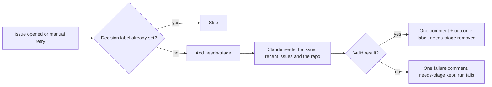

# GitHub intake: templates and triage

Canonical defaults for issues, pull requests, and triage live under [`templates/github/`](../templates/github/).
A repository's own files always win; these are the fallback.

| Asset | Default |
| --- | --- |
| Issue forms | `templates/github/ISSUE_TEMPLATE/`: bug report, feature request, maintenance, investigated report |
| PR templates | `templates/github/pull_request_template.md` (general), `PULL_REQUEST_TEMPLATE/bug.md`, `PULL_REQUEST_TEMPLATE/chore.md` |
| Triage playbook | `templates/github/triage/PLAYBOOK.md` |
| Triage workflow | `.github/workflows/issue-triage.yml` (reusable), called by `templates/github/workflows/issue-triage.yml` |

## Precedence

For each item, use the first that exists:

1. **Issue form or template:** the repository's `.github/ISSUE_TEMPLATE/` → the global default for the issue type.
2. **PR template:** the repository's `.github/pull_request_template.md` or `.github/PULL_REQUEST_TEMPLATE/<type>.md` → the global default for the change type.
3. **Triage playbook:** the repository's `.github/triage/PLAYBOOK.md` → the global playbook.
   A local playbook may add policy, such as how duplicates are handled, but the automated outcome set stays fixed.
4. **Label names:** the repository's approved mapping from [#25](https://github.com/Artic0din/agent-scripts/issues/25) → the role names below.

Also honour repository rules in `AGENTS.md` and `CONTRIBUTING.md`, such as a generated changelog or required review sections.

## Creating issues and PRs as an agent

- Pick the form by type: bug, feature, maintenance, or investigated report when the evidence is already gathered.
- `gh issue create --body-file` does not submit a form.
  Write each form field as a `### <field label>` heading, fill every required field, and pass the form's labels explicitly with `--label`.
- For PRs, fill the chosen template and pass it with `--body-file`.
  Tick only what was verified in this session.
- Search existing issues first; a matching issue gets a comment, not a new issue.
- Show the full text and get approval before posting, unless the task already authorises it.

## Triage roles

Triage labels apply to issues, not pull requests.
Until #25 approves final names, the defaults are the role names:

| Role | Default label | Meaning |
| --- | --- | --- |
| pending | `needs-triage` | Waiting for triage, or triage failed and needs a retry |
| needs-info | `needs-info` | Waiting on the reporter |
| ready-for-agent | `ready-for-agent` | Specified well enough for an agent |
| ready-for-human | `ready-for-human` | Needs a human decision or implementation |
| duplicate | `duplicate` | Matches an existing issue; nothing is closed automatically |
| wontfix | `wontfix` | Conflicts with documented scope |

Type labels such as `bug` or `enhancement` are separate and never block triage.

## Automatic triage

Every issue opened in an adopting repository is triaged, whoever opened it and through whichever channel: browser form, `gh`, the API, or an agent.
The one exception is an issue created by another workflow's `GITHUB_TOKEN`; see adoption step 5.

The agent job has read-only permissions and no shell, write, or network tools.
It returns a structured result, and [`scripts/issue-triage.py`](../scripts/issue-triage.py) validates it and makes every write.

- **Idempotent:** each issue has at most one triage comment, found by a hidden marker from `github-actions[bot]` and updated in place.
  Runs for the same issue are serialised, and an issue that already has a decision label is skipped.
- **Human decisions win:** if a person sets a decision label before or during a run, nothing is overwritten.
  To re-triage, remove the decision label, add `needs-triage`, and run the workflow manually.
- **No false success:** a missing secret, agent failure, or invalid result leaves `needs-triage`, posts a failure comment with the run link, and fails the run.
  Retry by re-running the failed jobs or running the workflow manually with the issue number.
  If a GitHub write itself fails, the run fails; a retry finishes a half-applied label change without overriding a different human decision.
- **Untrusted input:** issue text is redacted before it reaches the model and is passed as data, with older comments dropped past a size budget; agent text is redacted, stripped of HTML, images, and hidden markers, and has `@` mentions neutralised before posting.
- **No side effects:** triage never closes issues, opens issues or PRs, or edits code.

Duplicate detection compares the 300 most recent issues; older duplicates need a person.

## Adopting in a repository

1. Copy the issue forms and PR templates into `.github/` only where the repository has none of that kind.
   If it already has templates, compare fields and add missing ones by hand; never overwrite.
   Replace generic wording with repository specifics such as support links, environment fields, and areas.
2. Copy `templates/github/workflows/issue-triage.yml` to `.github/workflows/issue-triage.yml`.
   Pin the `uses:` ref and `agent-scripts-ref` to the same reviewed commit SHA, and set label inputs if the approved names differ.
3. Make `CLAUDE_CODE_OAUTH_TOKEN` available as a repository or organisation secret.
4. Create the role labels before enabling the workflow, or run the #25 label sync.
5. GitHub starts no workflow for an issue created with a workflow's own `GITHUB_TOKEN`.
   A workflow that creates issues that way must also run `gh workflow run issue-triage.yml -f issue-number=<n>`, which needs `actions: write`; dispatch events are exempt from that rule.
6. Open a test issue and confirm the outcome label and single comment appear.

Global instructions only reach agents.
Browser forms need the repository's own templates, and triage of browser and API submissions needs the workflow.

## Validation

`python3 scripts/test-issue-triage.py` covers gating, outcomes, retries, interrupted label changes, repeated delivery, human overrides, label overrides, duplicates, malformed results, redaction, and context building offline.
