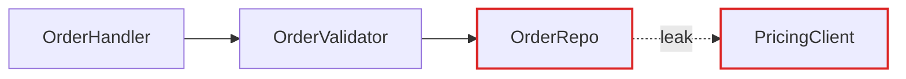

# HTML Report Format

The architectural review is a single self-contained HTML file in the OS temp directory.
Embed all CSS and static SVG diagrams; use system fonts and no runtime network dependencies.
If Mermaid is useful and local rendering tooling is available, render it to SVG during generation and embed that output.
Otherwise draw the diagram directly with inline SVG.

## Scaffold

```html
<!doctype html>
<html lang="en">
  <head>
    <meta charset="utf-8" />
    <title>Architecture review for {{repo name}}</title>
    <style>
      body { margin: 0; background: #fafaf9; color: #0f172a; font-family: system-ui, sans-serif; }
      main { max-width: 64rem; margin: auto; padding: 3rem 1.5rem; }
      section, article { margin-block: 2.5rem; }
      .diagram { border: 1px solid #cbd5e1; border-radius: .5rem; padding: 1rem; background: white; }
      .seam { stroke-dasharray: 4 4; }
      .leak { stroke: #dc2626; }
      .deep { background: linear-gradient(135deg, #0f172a, #1e293b); }
    </style>
  </head>
  <body>
    <main>
      <header>...</header>
      <section id="candidates">...</section>
      <section id="top-recommendation">...</section>
    </main>
  </body>
</html>
```

## Header

Repo name, date, and a compact legend: solid box = module, dashed line = seam, red arrow = leakage, thick dark box = deep module. No introduction paragraph. Straight into the candidates.

## Candidate card

The diagrams carry the weight. Prose is sparse, plain, and uses the glossary terms (from the `/codebase-design` skill) without ceremony.

Each candidate is one `<article>`:

- **Title**: short, names the deepening (e.g. "Collapse the Order intake pipeline").
- **Badge row**: recommendation strength (`Strong` = emerald, `Worth exploring` = amber, `Speculative` = slate), plus a tag for the dependency category (`in-process`, `local-substitutable`, `ports & adapters`, `mock`).
- **Files**: monospaced list, `font-mono text-sm`.
- **Before / After diagram**: the centrepiece. Two columns, side by side. See patterns below.
- **Problem**: one sentence. What hurts.
- **Solution**: one sentence. What changes.
- **Wins**: bullets, ≤6 words each. e.g. "Tests hit one interface", "Pricing logic stops leaking", "Delete 4 shallow wrappers".
- **ADR callout** (if applicable): one line in an amber-tinted box.

No paragraphs of explanation. If the diagram needs a paragraph to be understood, redraw the diagram.

## Diagram patterns

Pick the pattern that fits the candidate. Mix them. Don't make every diagram look the same. Variety is part of the point.

### Mermaid graph (the workhorse for dependencies / call flow)

Use a Mermaid `flowchart` or `graph` source when the point is "X calls Y calls Z, and look at the mess."
Render this source to static SVG before inserting it in a `.diagram` card; never leave Mermaid source awaiting a browser script.
Style with classDef to colour leakage edges red and the deep module dark.
Sequence diagrams work well for "before: 6 round-trips; after: 1."



### Hand-built boxes-and-arrows (when Mermaid's layout fights you)

Modules as `<div>`s with borders and labels. Arrows as inline SVG `<line>` or `<path>` elements positioned absolutely over a relative container. Reach for this when you want the "after" diagram to feel like one thick-bordered deep module with greyed-out internals, since Mermaid won't render that with the right weight.

### Cross-section (good for layered shallowness)

Stack horizontal bands (`h-12 border-l-4`) to show layers a call passes through. Before: 6 thin layers each doing nothing. After: 1 thick band labelled with the consolidated responsibility.

### Mass diagram (good for "interface as wide as implementation")

Two rectangles per module: one for interface surface area, one for implementation. Before: interface rectangle is nearly as tall as the implementation rectangle (shallow). After: interface rectangle is short, implementation rectangle is tall (deep).

### Call-graph collapse

Before: a tree of function calls rendered as nested boxes. After: the same tree collapsed into one box, with the now-internal calls shown faded inside it.

## Style guidance

- Lean editorial, not corporate-dashboard. Generous whitespace. Serif optional for headings (`font-serif` works well with stone/slate).
- Colour sparingly: one accent (emerald or indigo) plus red for leakage and amber for warnings.
- Keep diagrams ~320px tall so before/after sits comfortably side by side without scrolling.
- Use `text-xs uppercase tracking-wider` for module labels inside diagrams, so they read as schematic, not as UI.
- The report is static: embedded CSS and SVG, no scripts or network loads.
- Styling examples describe visual intent; define any classes used in the embedded stylesheet instead of assuming a utility framework is loaded.
- Open the generated file with networking disabled and verify diagrams and styling remain visible.

## Top recommendation section

One larger card. Candidate name, one sentence on why, anchor link to its card. That's it.

## Tone

Plain English, concise, but the architectural nouns and verbs come straight from the `/codebase-design` skill. Concision is not an excuse to drift.

**Use exactly:** module, interface, implementation, depth, deep, shallow, seam, adapter, leverage, locality.

**Never substitute:** component, service, unit (for module) · API, signature (for interface) · boundary (for seam) · layer, wrapper (for module, when you mean module).

**Phrasings that fit the style:**

- "Order intake module is shallow: interface nearly matches the implementation."
- "Pricing leaks across the seam."
- "Deepen: one interface, one place to test."
- "Two adapters justify the seam: HTTP in prod, in-memory in tests."

**Wins bullets** name the gain in glossary terms: *"locality: bugs concentrate in one module"*, *"leverage: one interface, N call sites"*, *"interface shrinks; implementation absorbs the wrappers"*. Don't write *"easier to maintain"* or *"cleaner code"*, because those terms aren't in the glossary and don't earn their place.

No hedging, no throat-clearing, no "it's worth noting that…". If a sentence could be a bullet, make it a bullet. If a bullet could be cut, cut it. If a term isn't in the `/codebase-design` glossary, reach for one that is before inventing a new one.
